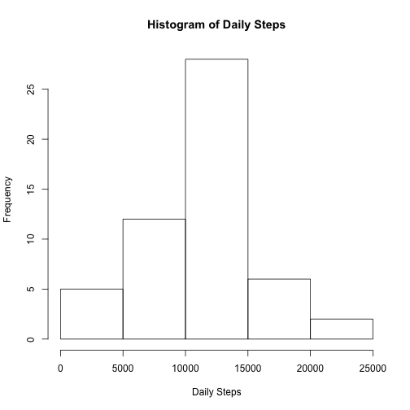
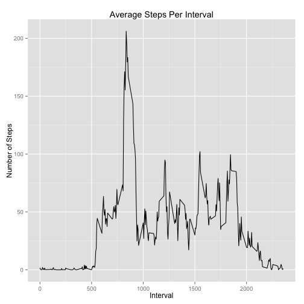
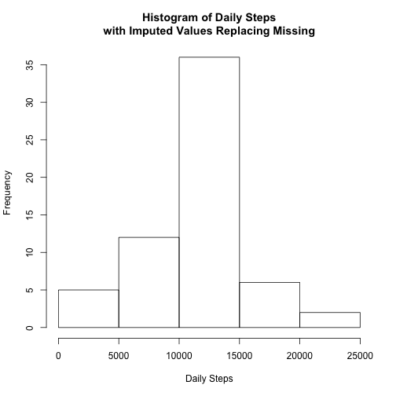
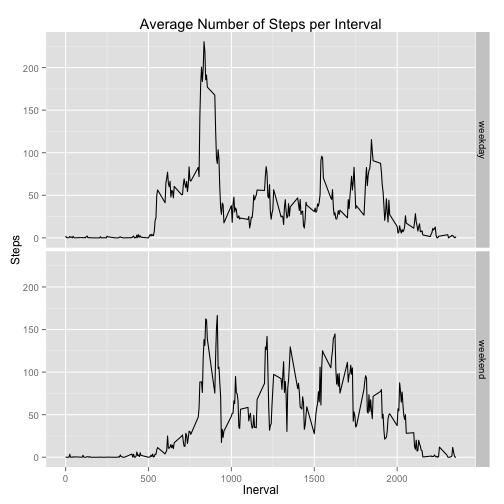

## Libraries used
This short analysis uses only the base r package and the ggplot2 library. The knitr package was used to produce the hmtl, but is really outside of the analysis and is not included here.

```r
echo = TRUE
library(ggplot2)
```

## Loading and preprocessing the data
The data in the csv are tidy, so there is minimal preprocessing that needs to be done, just conversion of the date variable to a Date class.

```r
activities <- read.csv("activity.csv")
activities$date <- as.Date(activities$date)
```


## What is mean total number of steps taken per day?
To calculate the mean and total number of steps per day, the activites data is aggregated by day, calculating the sum of all the steps in each day, into a new data frame _daily_. A histogram of steps is made from _daily_ showing a slightly skewed normal distribution with the majority of days having between 10,000 and 15,000 steps. 
The summary data shows a mean number of steps per day at 10,770, with a median number of steps per day at 10,760. 


```r
daily <- aggregate(steps ~ date, data = activities, sum)
hist(daily$steps, xlab = "Daily Steps", ylab = "Frequency", main = "Histogram of Daily Steps")
```

 
The summary data shows a mean number of steps per day at 10,770, with a median number of steps per day at 10,760. 

```r
summary(daily$steps)
```

```
##    Min. 1st Qu.  Median    Mean 3rd Qu.    Max. 
##      41    8841   10760   10770   13290   21190
```

## What is the average daily activity pattern?
The understand the average daily activity pattern first the activities data is aggregated by interval, calculating the average of number of steps in that interval across days, into a new data frame _inter_. The plot of the steps on interval shows a distinct period of higher step activity from around 8 am to around 9 am, peaking at over 200 average steps. After that, the number of steps is decidedly lower and the graph shows the average vacillating around 50 steps per interval until around 7 pm. 


```r
inter <- aggregate(steps ~ interval, data = activities, mean)
qplot(interval, steps, data = inter, geom = "line", main = "Average Steps Per Interval", xlab = "Interval", ylab= "Number of Steps")
```

 

The interval with the maximum average number of steps is 8:35 am, with 206 steps, and is returned by the code below. 

```r
inter[which(inter$steps == max(inter$steps)),]
```

```
##     interval    steps
## 104      835 206.1698
```

## Imputing missing values

The total number of intervals with missing step information in the whole data set is 2304, and is returned by:

```r
sum(is.na(activities$steps))
```

```
## [1] 2304
```

A simple strategy for filling in the missing values was applied using the average for that interval.
_Acto_ is the new data frame with imputed values replacing the missing values in the original data frame.


```r
acto <- merge(activities, inter, by = "interval")
acto <- acto[order(acto$date),]
acto$steps.x[is.na(acto$steps.x)] <- acto$steps.y[is.na(acto$steps.x)]
names(acto)[2] <- "steps"
acto <- acto[, c("interval", "steps", "date")]
```

The total number of steps taken each day is reached by aggregating the _acto_ data from down by steps on date, giving a new data frame _daily.acto_. A histogram of the number of steps daily shows a clear increase in the number of days with in the average range from 10,000 to 15,000 steps. This makes sense given that there are several days that have no data at all, so previously they would not have been included in the histogram, whereas now they are treated as an average day.

```r
daily.acto <- aggregate(steps ~ date, data= acto, sum)
hist(daily.acto$steps, main = "Histogram of Daily Steps\nwith Imputed Values Replacing Missing", xlab = "Daily Steps")
```

 

The code below returns the summary data for both the imputed and original daily steps. Note that the mean doesn't change, which is to be expected since we are just adding average values with the impuation. However, the median (and the quintiles do change) because the impuation changes the number of observations in each bin. 

```r
summary(daily.acto$steps)
```

```
##    Min. 1st Qu.  Median    Mean 3rd Qu.    Max. 
##      41    9819   10770   10770   12810   21190
```

```r
summary(daily$steps)
```

```
##    Min. 1st Qu.  Median    Mean 3rd Qu.    Max. 
##      41    8841   10760   10770   13290   21190
```

## Are there differences in activity patterns between weekdays and weekends?

To determine whether there are differences in step activity between weekdays or weekend days, a new variable was added to _acto_ (the imputed data frame) identifying the dates as weekdays or weekends. 

```r
echo = TRUE
acto$day <- weekdays(acto$date)
acto$day <- ifelse(grepl("Saturday|Sunday",acto$day),"weekend", "weekday")
acto$day <- as.factor(acto$day)
```

The plot of the weekend vs weekday data shows distinct differences in the average steps per interval. Both sets still have the highest activity around 8-9 am, but the weekend steps during that peak are decidedly fewer. However, during the rest of the weekend, the average step activity appears to be noticably higher. 

```r
weekdaily <- aggregate(steps ~ interval + day, acto, mean)
ggplot(aes(x = interval, y = steps), data = weekdaily) + 
        geom_line() + 
        facet_grid(day~.) +
        xlab("Inerval") +
        ylab("Steps") +
        ggtitle("Average Number of Steps per Interval")
```

 
The summary data for the weekends and weekdays confirm that both the mean and the median number of steps during the weekend are higher than the weekdays, even though the peak is much lower. 


```r
summary(weekdaily[weekdaily$day =="weekend", "steps"])
```

```
##    Min. 1st Qu.  Median    Mean 3rd Qu.    Max. 
##   0.000   1.241  32.340  42.370  74.650 166.600
```

```r
summary(weekdaily[weekdaily$day =="weekday", "steps"])
```

```
##    Min. 1st Qu.  Median    Mean 3rd Qu.    Max. 
##   0.000   2.247  25.800  35.610  50.850 230.400
```
